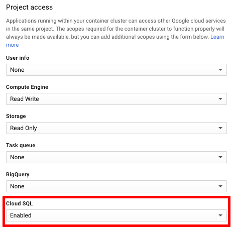
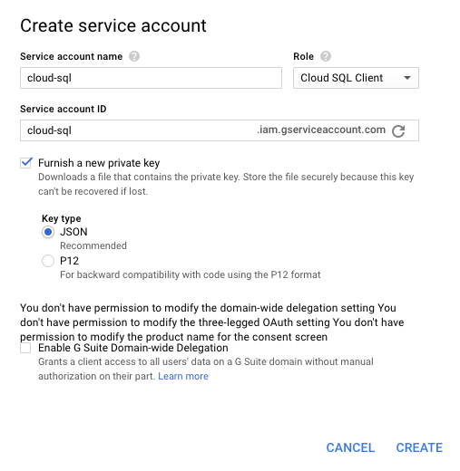

## Google Cloud SQL second generation

Google highly recommends to use CloudSQL proxy to connect to a Second Generation Cloud SQL database to avoid dealing with IP whitelisting or SSL certificates manually.

Before following the guide, make sure that created CloudSQL instance has:
- a pre-existing schema named `draios` with character-set and collation configured to UTF-8,
- a pre-existing user and password correspondent to the account configured in the sysdigcloud configmap.

##### Enable Goolge Cloud SQL API

- The CloudSQL proxy uses CloudSQL APIs. If those haven't been enabled yet in the given project, visit the [API Manager page](https://console.cloud.google.com/apis/) and enable `Google Cloud SQL API`.

- The CloudSQL proxy application will run within the container cluster. In order to access Google Cloud SQL service when creating the Kubernetes cluster, make sure to add "Cloud SQL" permission to the cluster as shown in the following image:

<p align="center">
  
</p>

##### CloudSQL proxy credentials
Kubernetes does not support the metadata server that is used by default for credentials, so we have to manually pass the credentials to the proxy as a Kubernetes Secret.

Visit the [IAM console](https://console.cloud.google.com/iam-admin/serviceaccounts) and create a service account `cloud-sql` with the role `CloudSQL Client` and download the credential file in JSON format.

<p align="center">
  
</p>

Once you have downloaded the credentials file, create the following Kubernetes secret:

```
kubectl create secret generic cloudsql-oauth-credentials --from-file=credentials.json=<PATH_TO_CREDENTIAL_FILE> --namespace=sysdigcloud
```

##### Deploy CloudSQL proxy 

Edit the file under manifests/mysql-proxy.yaml and properly configure the `INSTANCE_CONNECTION_NAME` variable.

Deploy the CloudSQL proxy using:
```
kubectl create -f manifests/mysql-proxy.yaml --namespace=sysdigcloud
```